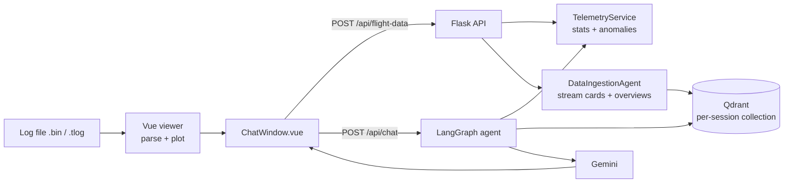

# UAV Log Viewer + AI Flight Analysis Chat

Ask questions about a drone flight log in plain English, answered from the log's own telemetry.


> This is a fork of [ArduPilot/UAVLogViewer](https://github.com/ArduPilot/UAVLogViewer), the JavaScript viewer for MAVLink telemetry and Dataflash logs ([live demo of upstream](http://plot.ardupilot.org)). The plotting and 3D visualization come from upstream. This fork adds a chat panel and a Python backend that answers questions about the loaded log.

## Overview

Flight logs have thousands of messages across many streams, and finding things like "what was the max altitude?" or "were there GPS problems?" means clicking through plots. This fork adds a chat window to the viewer. It sends the parsed log to a Flask backend, which turns the telemetry into structured summaries, indexes them in a vector store, and uses Google Gemini to answer questions from that context only. If the context does not hold the answer, it says so.

## What this fork adds

- **Chat panel in the viewer** (`src/components/ChatWindow.vue`), plus data extractors that turn parsed MAVLink/Dataflash logs into JSON for the backend (`src/tools/mavlinkDataExtractor.js`, `src/tools/dataflashDataExtractor.js`).
- **Flask REST API** (`backend_api/app.py`) with per-session state tracked by an `X-Session-ID` header.
- **Telemetry processing** (`telemetry_service.py`): GPS, altitude, battery, attitude and event streams with statistics, units, time ranges, sampling rates, missing data and anomaly checks.
- **Ingestion agent** (`ingestion_agent.py`): builds "stream cards" and overview documents (flight overview, data quality, GPS issues, anomalies) for retrieval, and writes them to `rag_docs/session_<id>/` so you can check what the model sees.
- **LangGraph agent** (`agent.py`): a think → act → respond loop over the session's telemetry and retrieved context.
- **Grounding guardrails** (`config.py`): minimum retrieval score and hit count, a verification pass, session-ID redaction and plain-text output cleanup, all set with environment variables.
- **Optional Qdrant vector search** (`qdrant_service.py`) with Gemini embeddings, and opt-in lookup of the ArduPilot docs.

## Tech stack

| Layer | Tools |
|-------|-------|
| Frontend (upstream + chat) | Vue.js, Plotly, Cesium, Webpack |
| Backend (this fork) | Python, Flask, flask-cors, LangGraph, LangChain |
| LLM / embeddings | Google Gemini (`langchain-google-genai`, `google-generativeai`) |
| Vector store | Qdrant (`qdrant-client`) |
| Data | NumPy, pandas, Pydantic |

## How it works



A deeper walkthrough of the request cycle and guardrails is in [`backend_api/README.md`](backend_api/README.md) and [`CHATBOT_OVERVIEW.md`](CHATBOT_OVERVIEW.md).

### API endpoints

| Method | Path | Purpose |
|--------|------|---------|
| GET | `/api/health` | Health check |
| POST | `/api/flight-data` | Upload parsed flight data for a session |
| POST | `/api/chat` | Ask a question about the session's flight |
| GET | `/api/session/<session_id>/summary` | Session summary |
| POST | `/api/session/<session_id>/reset` | Reset a session |
| GET | `/api/telemetry/<session_id>/<parameter>` | Telemetry for one parameter |
| GET | `/api/anomalies/<session_id>` | Detected anomalies |
| GET | `/api/debug/sessions` | List active sessions (debug) |

## Repository structure

```
UAVLogViewer/
├── src/                        # Vue frontend (upstream)
│   ├── components/ChatWindow.vue   # chat panel (added)
│   └── tools/*DataExtractor.js     # log -> JSON for backend (added)
├── backend_api/                # Flask + LangGraph backend (added)
│   ├── app.py                  # REST API entry point
│   ├── agent.py                # LangGraph think/act/respond agent
│   ├── ingestion_agent.py      # builds retrieval documents per session
│   ├── telemetry_service.py    # stream extraction, stats, anomalies
│   ├── gemini_service.py       # Gemini chat + embeddings
│   ├── qdrant_service.py       # vector store wrapper
│   ├── session_manager.py      # per-session state
│   ├── config.py               # env-driven settings
│   ├── env.example             # environment template
│   └── requirements.txt
├── CHATBOT_OVERVIEW.md         # design notes for the chatbot
├── Dockerfile                  # frontend container (upstream)
└── package.json
```

## Getting started

### 1. Frontend (viewer + chat panel)

```bash
# initialize submodules
git submodule update --init --recursive

# install dependencies
npm install

# enter Cesium token
export VUE_APP_CESIUM_TOKEN=<your token>

# serve with hot reload at localhost:8080
npm run dev

# build for production with minification
npm run build

# run unit tests
npm run unit

# run e2e tests
npm run e2e

# run all tests
npm test
```

### 2. Backend (chat API)

Requires Python 3.10+ and a Google Gemini API key. Qdrant is optional.

```bash
cd backend_api
python -m venv venv && source venv/bin/activate
pip install -r requirements.txt

cp env.example .env   # then set GOOGLE_API_KEY (and QDRANT_URL / QDRANT_API_KEY if used)
python app.py         # serves on http://localhost:8000
```

The frontend calls the backend at `http://localhost:8000/api`. Check it is up at `http://localhost:8000/api/health`. See [`backend_api/README.md`](backend_api/README.md) for all configuration options.

### Docker (frontend, from upstream)

Run the prebuilt upstream image:

```bash
docker run -p 8080:8080 -d ghcr.io/ardupilot/uavlogviewer:latest
```

or build the Dockerfile locally:

```bash
# Build Docker Image
docker build -t <your username>/uavlogviewer .

# Run Docker Image
docker run -e VUE_APP_CESIUM_TOKEN=<Your cesium ion token> -it -p 8080:8080 -v ${PWD}:/usr/src/app <your username>/uavlogviewer

# Navigate to localhost:8080 in your web browser
```

The prebuilt image is upstream's and does not include the chat panel. Build locally to get this fork's frontend.

## Credits and license

The log viewer, parsers and visualization are the work of the [ArduPilot UAVLogViewer](https://github.com/ArduPilot/UAVLogViewer) contributors. This fork is distributed under the same GPL-3.0 license; see [LICENSE](LICENSE).

## Author

Chat panel and backend by **Dhruv Joshi**: [GitHub](https://github.com/DJCodesStuff) · [Portfolio](https://djcodesstuff.github.io/)
